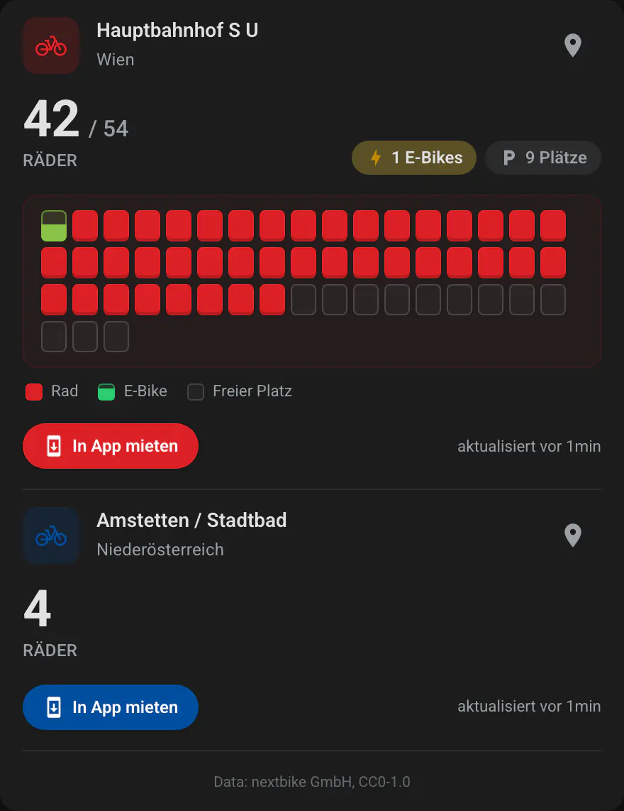
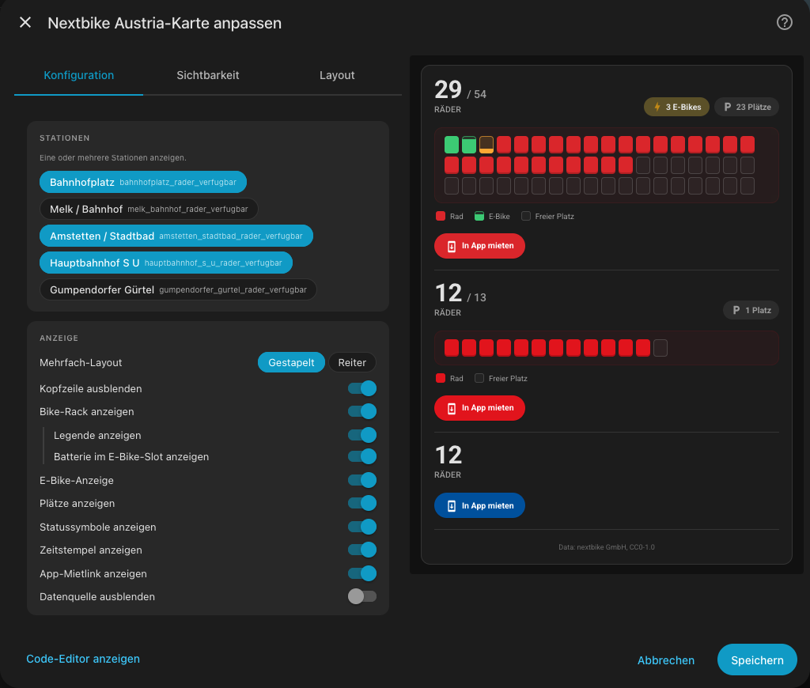
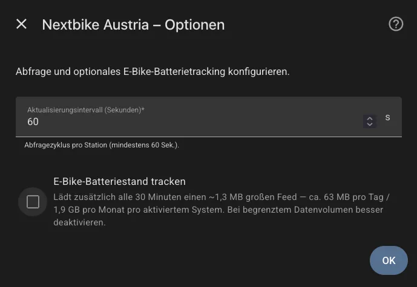

# Nextbike Austria

[](https://github.com/hacs/integration)
[](https://www.home-assistant.io/)
[](https://github.com/rolandzeiner/nextbike-austria/releases)
[](https://opensource.org/licenses/MIT)
[](https://en.wikipedia.org/wiki/Vibe_coding)

Home Assistant integration for nextbike-operated bike-sharing stations across Austria. Uses the official [GBFS 2.3 feeds](https://github.com/MobilityData/gbfs) — no API key, no YAML editing, station-level tracking out of the box.

Pick a city, type a station name, save. One device per station with three sensors: bikes available, docks available, e-bikes available.

## Supported Systems

Six Austrian nextbike systems are recognized in the config flow:

| System | Region | ~Stations |
|---|---|---:|
| `nextbike_wr` | Wien — **WienMobil Rad** | 259 |
| `nextbike_la` | **Niederösterreich** (St. Pölten, Wr. Neustadt, Tulln, Mödling, …) | 239 |
| `nextbike_si` | Innsbruck — **Stadtrad** | 55 |
| `nextbike_vt` | Tirol — **VVT REGIORAD** (Kufstein) | 21 |
| `nextbike_al` | Linz — **city bike Linz** | 50 |
| `nextbike_ka` | **Klagenfurt** | 48 |

If your city uses nextbike under a different `system_id`, open an issue — adding a system is a one-line change in `const.py` once the feed endpoint is verified.

## Supported Functions

- **Real-time station state** for any nextbike station in the six supported Austrian systems.
- **Three sensors per station**:
  - `Bikes available` — total bikes currently parked.
  - `Docks available` — empty slots (or `unknown` if the system doesn't publish dock counts — see [Known Limitations](#known-limitations)).
  - `E-bikes available` — subset of bikes whose vehicle type is pedelec / throttle-electric, per the system's `vehicle_types` feed.
- **Multi-step config flow**: pick system → type station name → pick matching station from the dropdown. Live catalogue fetch during setup verifies the feed is reachable.
- **Reconfigure flow** to switch to a different station at the same system without losing the entry; **options flow** to change polling interval.
- **Shared per-system polling**: if you track 10 Vienna stations, only one HTTP request fetches the feed every 60 s — each entry reads its station out of the shared snapshot.
- **Optional e-bike battery + reservation tracking** (new in 0.2.0): enable *Track e-bike battery state* per entry to additionally fetch the `free_bike_status` feed every 30 min. Surfaces per-station battery aggregates (avg / min / max %), a sorted per-bike battery list, reserved-bike counts, and out-of-service (disabled) bike counts. Off by default — the extra feed is ~1.3 MB per fetch (see [Data Updates](#data-updates)).
- **Rich attributes** on the `Bikes available` sensor: `station_id`, `system_id`, `capacity`, `latitude`, `longitude`, `is_installed`, `is_renting`, `is_returning`, `last_reported`, `vehicle_types_available` breakdown, and a direct `rental_uri` deep-link into the nextbike app.
- **Station-gone repair flow**: if the operator retires a station mid-operation, a Repairs notification surfaces and auto-clears when the station reappears or the entry is removed.
- **Diagnostics download** with attribution, coordinator state, redacted coordinates, full station snapshot. Coordinates are stripped before download.

## Screenshots

<table>
  <tr>
    <td align="center"></td>
    <td align="center"></td>
    <td align="center"></td>
  </tr>
  <tr>
    <td align="center"><em>Lovelace card</em></td>
    <td align="center"><em>Card editor</em></td>
    <td align="center"><em>Config flow</em></td>
  </tr>
</table>

## Requirements

- Home Assistant **2025.1** or newer.
- **No API key** needed — all Austrian nextbike GBFS feeds are public.
- Outbound HTTPS access to `gbfs.nextbike.net`.

## Installation

### HACS (recommended)

1. HACS → **Integrations** → ⋯ → **Custom repositories**.
2. Add `https://github.com/rolandzeiner/nextbike-austria` as type **Integration**.
3. Search for "Nextbike Austria" and install.
4. Restart Home Assistant.

[](https://my.home-assistant.io/redirect/hacs_repository/?owner=rolandzeiner&repository=nextbike-austria&category=integration)

### Manual

1. Copy `custom_components/nextbike_austria/` into your HA `config/custom_components/`.
2. Restart Home Assistant.

## Setup

[](https://my.home-assistant.io/redirect/config_flow_start/?domain=nextbike_austria)

1. **Settings → Devices & Services → + Add Integration**.
2. Search for **Nextbike Austria**.
3. Pick the nextbike system (city / region) from the list.
4. Type part of a station name (minimum 2 characters) and submit. The integration probes the GBFS `station_information` feed to verify it's reachable and to fetch fresh matches.
5. Pick the station from the dropdown. Labels show capacity when published (e.g. `"Hoher Markt (capacity 25)"`).
6. Set the polling interval (default 60 s, minimum 60 s per the GBFS `ttl`, maximum 900 s) and save.

Add more stations by running **Add Integration** again. Each station is its own config entry with its own Device in HA.

## Sensor Attributes

Every `Bikes available` sensor carries:

| Attribute | Type | Example / notes |
|---|---|---|
| `state` (native value) | int | Count of bikes currently parked. |
| `attribution` | string | `"Data: nextbike GmbH, CC0-1.0"` — always present. |
| `station_id` | string | GBFS station identifier (stable across polls). |
| `system_id` | string | One of `nextbike_wr`, `nextbike_la`, `nextbike_si`, `nextbike_vt`, `nextbike_al`, `nextbike_ka`. |
| `capacity` | int \| null | Total docks. `null` for systems that don't publish capacity (most of NÖ). |
| `latitude` / `longitude` | float | Coordinates — redacted from diagnostics downloads. |
| `is_installed` / `is_renting` / `is_returning` | bool | Station online, can rent, can return. |
| `last_reported` | int | Unix epoch seconds of the station's last status update. |
| `vehicle_types_available` | list[dict] | Per-type count breakdown: `[{"vehicle_type_id": "183", "count": 17}, …]`. |
| `rental_uri` | string | Web deep-link (`https://nxtb.it/p/{id}`) that opens the nextbike app to this station. |

When **Track e-bike battery state** is enabled on an entry, the `Bikes available` sensor also carries (keys are omitted when the source is unavailable — templates can gate on `if 'x' in attrs`):

| Attribute | Type | Example / notes |
|---|---|---|
| `e_bike_avg_battery_pct` / `min` / `max` | float | Per-station battery % aggregated from e-bikes reporting `current_fuel_percent`. Upstream coverage is ~8.6% — stations with zero reporting bikes omit these keys. |
| `e_bike_range_samples` | int | How many bikes at this station contributed a sample. |
| `e_bike_battery_list` | list[dict] | Sorted max→min: `[{"pct": 95.0, "type": "E-Bike"}, …]`. Drives per-slot battery fill in the bundled card. |
| `bikes_reserved` | int | Bikes physically at the station but held by another user. Only present when >0. |
| `bikes_reserved_types` | list[str] | Vehicle-type name per reserved bike (parallel to count). |
| `bikes_disabled` | int | Bikes physically at the station but out of service (flat tire, broken lock …). Only present when >0. |
| `bikes_disabled_types` | list[str] | Vehicle-type name per disabled bike. |
| `vehicle_type_names` | dict | `{vehicle_type_id: display_name}` — used by the card for slot tooltips. Always present when tracking is on. |

The `Docks available` sensor additionally exposes `is_virtual_station` and `capacity` so you can tell a geofence from a rack station when building dashboards.

## Data Updates

- Poll interval defaults to **60 s** (the value the GBFS feed advertises in `ttl`). Faster polling returns the same cached body, so the integration caps the form at 60 s on the floor and 900 s on the ceiling.
- **Per-system shared fetch**: one HTTP request per system per poll, regardless of how many stations in that system are tracked. Implemented as a memoized client in `hass.data[DOMAIN]["systems"]` with a TTL lock that collapses concurrent calls.
- `vehicle_types.json` is fetched once at startup (nearly static) and only refreshed when empty; it's what drives the e-bike detection heuristic.
- **Battery / reservation tracking** (opt-in): with *Track e-bike battery state* enabled on at least one entry, the shared client additionally fetches `free_bike_status.json` every **30 min** (independent of the station poll interval). The feed is ~1.3 MB for Wien — approximately **63 MB/day / 1.9 GB/month** per opted-in Austrian system. Leave off if your bandwidth is capped.
- All payloads are parsed with `json.loads(..., strict=False)` because nextbike occasionally emits raw control characters in `vehicle_types` descriptions — a tolerated quirk rather than a broken feed.

## Use Cases

- **Commute helper** — "if the station next to my flat has zero bikes at 07:15, send me a push so I start walking to the S-Bahn instead."
- **Return-side automation** — "if my home station has fewer than 2 free docks when I'm about to arrive, alert me to divert to the next one." (Requires a system that publishes capacity — see Known Limitations.)
- **E-bike monitoring** — "notify me when an e-bike appears at Hauptbahnhof between 17:00–19:00". Use the `E-bikes available` sensor directly.
- **Rebalancing visibility** — dashboards showing which nearby stations are empty / full; the `rental_uri` attribute makes every station a one-click rental link.

## Automation Examples

```yaml
# Notify when an e-bike shows up at your home station during evening rush
automation:
  - alias: "E-bike back at Hoher Markt"
    trigger:
      - platform: numeric_state
        entity_id: sensor.hoher_markt_ebikes_available
        above: 0
    condition:
      - condition: time
        after: "17:00:00"
        before: "19:00:00"
    action:
      - service: notify.mobile_app_my_phone
        data:
          message: "E-bike available at Hoher Markt now."
```

```yaml
# Dashboard entity-filter card: only stations with bikes right now
type: entity-filter
entities:
  - sensor.hoher_markt_rader_verfugbar
  - sensor.oper_karlsplatz_u_rader_verfugbar
  - sensor.westbahnhof_s_u_rader_verfugbar
state_filter:
  - operator: ">"
    value: 0
card:
  type: entities
  title: Bikes available near me
```

## Known Limitations

- **Niederösterreich dock data is incomplete.** The `nextbike_la` system publishes `capacity` for only 10 out of 239 stations, and permanently reports `num_docks_available: 0` for the rest — regardless of whether the station is empty or full. The integration detects this (missing `capacity` field) and reports the `Docks available` sensor as **`unknown`** rather than a misleading `0`. Wien, Innsbruck, Tirol, Linz, and Klagenfurt publish dock counts for nearly every station.
- **Station IDs are stable but `bike_id`s rotate** (privacy rotation by nextbike). Don't write automations keyed on individual bike identifiers — they won't persist across ticks.
- **Virtual stations** (`is_virtual_station: true`) are geofences without physical docks. The `Docks available` sensor reads 0 on these by design; use the `Bikes available` sensor instead.
- **`num_bikes_available` can exceed `capacity`** when bikes are crammed at full stations (observed at Hoher Markt with 29/25). Don't template on `capacity - bikes` as a synonym for "docks free".
- **Per-bike detail is opt-in.** `free_bike_status.json` (battery levels via `current_fuel_percent`, per-bike `is_reserved` / `is_disabled` flags) is ~1.3 MB per system and skipped entirely unless *Track e-bike battery state* is enabled on at least one entry. Only ~8.6% of e-bikes report a battery sample upstream — a station may opt in and still see no battery data until at least one of its bikes reports.

## Troubleshooting

- **"Cannot connect" during setup.** The `station_information` probe failed. Usually transient; retry. Verify connectivity to `https://gbfs.nextbike.net/maps/gbfs/v2/`.
- **Sensor state stuck at `unavailable`.** The station may have been retired upstream. Check for a Repairs notification (`station_gone`) — if present, remove the entry and add a different station.
- **All three sensors read 0 for a Wien or Innsbruck station.** The station is real, it just happens to be empty (or full). Watch for a couple of minutes; city-center stations turn over constantly.
- **Collecting diagnostics for a bug report.** Settings → Devices & Services → Nextbike Austria → ⋯ → Download diagnostics. Coordinates are redacted automatically.
- **Debug logs:**
  ```yaml
  # configuration.yaml
  logger:
    default: info
    logs:
      custom_components.nextbike_austria: debug
  ```

## Attribution

All data flows through the [nextbike GBFS 2.3 feeds](https://github.com/MobilityData/gbfs) and is published under the **Creative Commons Zero 1.0 Public Domain Dedication** (CC0-1.0), as declared in each system's `system_information.license_id`. No legal attribution is required — crediting nextbike is good practice but not obligatory. The integration surfaces the attribution string on every sensor regardless:

> Data: nextbike GmbH, CC0-1.0

## Removal

1. **Settings → Devices & Services** → find the Nextbike Austria entry → ⋯ → **Delete**.
2. Repeat for each tracked station (one entry per station).
3. Remove `custom_components/nextbike_austria/` from the HA config (manual installs only; HACS removes it automatically).

## License

MIT — see [LICENSE](LICENSE). The integration code is MIT; nextbike data flowing through it is CC0-1.0 (public domain).

## Disclaimer

This integration is not affiliated with or endorsed by nextbike GmbH. All station and bike-availability data is provided through public [GBFS 2.3 feeds](https://github.com/MobilityData/gbfs) operated by nextbike and its Austrian partners, and is published under the Creative Commons Zero 1.0 Public Domain Dedication (CC0-1.0). The developer assumes no liability for the accuracy, completeness, or timeliness of the displayed data — including but not limited to bike availability, dock availability, station operational status, or estimated e-bike range. Use at your own risk.

---

Diese Integration steht in keiner Verbindung zur nextbike GmbH und wird von dieser nicht unterstützt. Alle Stations- und Verfügbarkeitsdaten stammen aus öffentlichen [GBFS-2.3-Feeds](https://github.com/MobilityData/gbfs), die von nextbike und ihren österreichischen Partnern betrieben und unter der Creative-Commons-Lizenz „Public Domain Dedication" (CC0-1.0) veröffentlicht werden. Für die Richtigkeit, Vollständigkeit und Aktualität der angezeigten Daten — einschließlich Rad- und Platzverfügbarkeit, Stationsstatus oder geschätzter E-Bike-Reichweite — wird keine Haftung übernommen. Nutzung auf eigene Verantwortung.
